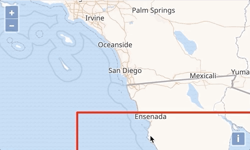

# Interact with VectorTile features

The nice thing about vector tiles is that we can interact with features, because we have the data on the client. One thing to note though is that vector tiles are optimized for rendering. This means that features only contain attributes that are needed for filtering and rendering, and that geometries are optimized for the rendered resolution and clipped near the tile boundary.

For this exercise, we're going to draw a box around the features at the pointer's location when hovering over them.

## Adding a vector layer for displaying bounding boxes

We will be drawing the bounding boxes of the hovered features on a separate layer. The following imports are needed, and we add them next to the other imports in `main.js`:

[import:'import-layer'](../../../src/en/examples/vectortile/interact.js)

Next, we can create a source for the layer, the layer, and assign it to the map:

[import:'layer'](../../../src/en/examples/vectortile/interact.js)

## Interacting with the map

Now it is time to add a `pointermove` listener to the map, which gets all the features at the pointer location and adds their bounding boxes to the layer. We need two additional imports for that:

[import:'import-interaction'](../../../src/en/examples/vectortile/interact.js)

Finally we can add the code that clears the current contents of the source and adds the bounding boxes for the features at the pointer location as new content:

[import:'interaction'](../../../src/en/examples/vectortile/interact.js)

Now when hovering over the map, the result should look like this:

