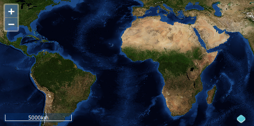
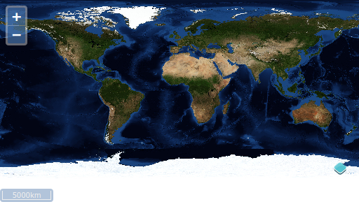

# Mostrando a barra de escala

A barra de escala é um controle muito comum de encontrarmos num mapa. O OpenLayers fornece uma classe `ol.control.ScaleLine` para isso.

## Criando um controle ScaleLine

### Tarefas

1.  Abra o arquivo `map.html` no seu editor.

1.  Em algum lugar na configuração do mapa, adicione o código para criar o controle ScaleLine:

  ```js
    controls: ol.control.defaults().extend([
      new ol.control.ScaleLine()
    ]),
  ```

1. Salve suas alterações e abra o arquivo `map.html`em seu navegador: {{ book.workshopUrl }}/map.html

  

## Reposicionando o controle

Talvez você ache um pouco difícil enxergar o controle sobre a imagem. Há algumas alternativas para melhorar a visualização da escala. Se você quiser manter o controle na região do mapa, você pode adicionar algumas declarações de estilo ao seu documento. Vamos testar alterando a cor de fundo e alterando o `padding` do controle:

```css
  .ol-scale-line {
    background: black;
    padding: 5px;
  }
```

Contudo, a título de exemplo, vamos imaginar que seu mapa já esteja com muitas informações. Para evitar adicionar mais um controle sobre ele, podemos exibir o ScaleLine em um local diferente. Para isso, precisamos criar um elemento de marcação adicional e dizer para o controle o novo local de renderização.

### Tarefas

1. Crie um novo elemento em nível de bloco no `<body>`de sua página. Para tornar mais fácil o referenciamento deste novo elemento, forneceremos um identificador através do atributo `id`. Insira o seguinte código em algum lugar dentro do elemento `<body>` da sua página `map.html`(faz sentido colocá-lo logo depois do trecho `<div id="map"></div>`):

  ```html
    <div id="scale-line" class="scale-line"></div>
  ```

1. Agora modifique o código criando o controle ScaleLine e fazendo com que ele referencie este elemento:

  ```js   
    controls: ol.control.defaults().extend([
      new ol.control.ScaleLine({className: 'ol-scale-line', target: document.getElementById('scale-line')})
    ]),
  ```

1. Salve suas alterações e abra o arquivo `map.html` no navegador: {{ book.workshopUrl }}/map.html    

1. Defina a posição do controle com, por exemplo, a seguinte declaração CSS:

  ```css    
    .scale-line {
      position: absolute;
      top: 350px;
    }
    .ol-scale-line {
      position: relative;
      bottom: 0px;
      left: 0px;
    }
  ```

1. Salve suas alterações e abra o arquivo `map.html` novamente no navegador: {{ book.workshopUrl }}/map.html    

  

*Nota* - Para criar um controle personalizado você pode herdar (usando a classe `ol.inherits`) da classe `ol.control.Control`. Para ver um exemplo, veja: http://openlayers.org/en/master/examples/custom-controls.html.
