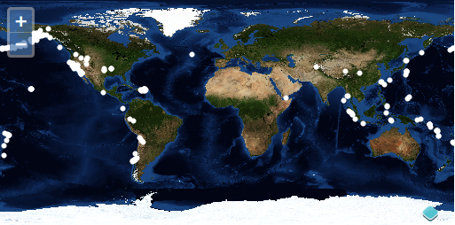

# Camadas vetoriais

Camadas vetoriais são representadas pela classe `ol.layer.Vector` e delegam para o cliente a renderização dos dados. Atualmente, o OpenLayers suporta uma renderização vetorial completa utilizando o Canvas, mas somente geometrias do tipo ponto no WebGL.

## Renderizando features no cliente

Vamos voltar ao exemplo WMS para gerar um mapa básico do mundo. Adicionaremos algumas geometrias sobre o mapa numa camada vetorial.

```html
<!doctype html>
<html lang="en">
  <head>
    <link rel="stylesheet" href="/ol.css" type="text/css">
    <style>
      #map {
        height: 256px;
        width: 512px;
      }
    </style>
    <title>OpenLayers example</title>
    <script src="/loader.js" type="text/javascript"></script>
  </head>
  <body>
    <h1>My Map</h1>
    <div id="map"></div>
    <script type="text/javascript">
      var map = new ol.Map({
        target: 'map',
        layers: [
          new ol.layer.Tile({
            title: 'Global Imagery',
            source: new ol.source.TileWMS({
              url: 'https://ahocevar.com/geoserver/wms',
              params: {LAYERS: 'nasa:bluemarble', TILED: true}
            })
          })
        ],
        view: new ol.View({
          projection: 'EPSG:4326',
          center: [0, 0],
          zoom: 0,
          maxResolution: 0.703125
        })
      });
    </script>
  </body>
</html>
```

### Tarefas

1. Abra o arquivo `map.html` no seu editor de texto e copie o conteúdo inicial do exemplo WMS. Salve suas alterações e confirme que está funcionando no seu navegador: {{ book.workshopUrl }}/map.html

1. No seu código de inicialização, adicione outra camada depois da camada Tile (cole o código abaixo). Isto adiciona uma nova camada vetorial ao seu mapa. Ela requisitará um conjuntos de features armazenadas no formato GeoJSON:

  ```js
    new ol.layer.Vector({
      title: 'Earthquakes',
      source: new ol.source.Vector({
        url: '/data/layers/7day-M2.5.json',
        format: new ol.format.GeoJSON()
      }),
      style: new ol.style.Style({
        image: new ol.style.Circle({
          radius: 3,
          fill: new ol.style.Fill({color: 'white'})
        })
      })
    })
  ```

  

### Olhando mais de perto

Vamos examinar a criação da camada vetorial para termos uma ideia do que está acontecendo.

```js
new ol.layer.Vector({
  title: 'Earthquakes',
  source: new ol.source.Vector({
    url: '/data/layers/7day-M2.5.json',
    format: new ol.format.GeoJSON()
  }),
  style: new ol.style.Style({
    image: new ol.style.Circle({
      radius: 3,
      fill: new ol.style.Fill({color: 'white'})
    })
  })
})
```

A camada recebe o título de `'Earthquakes'` e algumas outras opções. Dentre as opções, incluímos uma chave `source` do tipo `ol.source.Vector` que aponta para uma url. Além disso, fornecemos o formato (`format`) que será utilizado para fazer o parser dos dados.

*Nota* - Caso você quisesse estilizar features em função de algum atributo, você usaria uma função de estilo ao invés do `ol.style.Style` para a opção `style` da classe `ol.layer.Vector`.

### Tarefa de Bônus

1. Os círculos brancos no mapa representam um objeto `ol.Feature` da sua camada `ol.layer.Vector`. Cada uma dessas features, possui as propriedades `title` e `summary`. Registre um listener `'singleclick'` no mapa que chama o método `forEachFeatureAtPixel` e mostra informações sobre o terremoto abaixo do mapa.

1. Os dados da camada vetorial são de um feed publicado pela USGS (http://earthquake.usgs.gov/earthquakes/catalogs/). Veja se você consegue encontrar informações adicionais em formatos suportados pelo OpenLayers. Se você salvar outro documento no diretório `data`, você deve ser capaz de visualizá-lo por meio de uma camada vetorial. 

### Soluções

Você pode adicionar uma div `info` abaixo do seu mapa para responder a primeira tarefa de bônus:

```html
<div id="info"></div>
```

e adicionar o seguinte código JavaScript para mostrar o título do objeto que recebeu o clique:

```js
map.on('singleclick', function(e) {
  var feature = map.forEachFeatureAtPixel(e.pixel, function(feature) {
    return feature;
  });
  var infoElement = document.getElementById('info');
  infoElement.innerHTML = feature ? feature.get('title') : '';
});
```
