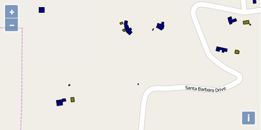

# Estilizando camadas vetoriais

1. Iniciaremos com um exemplo completo que mostra edifícios numa camada vetorial. Abra o seu editor de textos e salve-o como `map.html` no diretório raiz do workshop:

  ```html
  <!doctype html>
  <html lang="en">
    <head>
      <link rel="stylesheet" href="/ol.css" type="text/css">
      <style>
      #map {
        height: 256px;
        width: 512px;
      }
      </style>
      <title>OpenLayers example</title>
      <script src="/loader.js" type="text/javascript"></script>
    </head>
    <body>
      <h1>My Map</h1>
      <div id="map"></div>
      <script type="text/javascript">
        var map = new ol.Map({
          target: 'map',
          layers: [
            new ol.layer.Tile({
              source: new ol.source.OSM()
            }),
            new ol.layer.Vector({
              title: 'Buildings',
              source: new ol.source.Vector({
                url: '/data/layers/buildings.kml',
                format: new ol.format.KML({
                  extractStyles: false
                })
              }),
              style: new ol.style.Style({
                stroke: new ol.style.Stroke({color: 'red', width: 2})
              })
            })
          ],
          view: new ol.View({
            center: ol.proj.fromLonLat([-122.79264450073244, 42.30975194250527]),
            zoom: 16
          })
        });
      </script>
    </body>
  </html>
  ```

1. Abra o arquivo `map.html` no seu navegador para ver os edifícios com borda vermelha: {{ book.workshopUrl }}/map.html

1. Com uma compreensão básica dos [estilos no OpenLayers](style-intro.md), podemos criar uma função de estilo que mostra os edifícios em difentes cores baseadas no tamanho de sua área. No código de inicialização do seu mapa, adicione dois arrays de estilos e troque a opção `style` para a camada `'Buildings'` com a função abaixo:

  ```js
    var defaultStyles = [
      new ol.style.Style({
        fill: new ol.style.Fill({color: 'navy'}),
        stroke: new ol.style.Stroke({color: 'black', width: 1})
      })
    ];
    var smallStyles = [
      new ol.style.Style({
        fill: new ol.style.Fill({color: 'olive'}),
        stroke: new ol.style.Stroke({color: 'black', width: 1})
      })
    ];

    function style(feature, resolution) {
      if (feature.get('shape_area') < 3000) {
        return smallStyles;
      } else {
        return defaultStyles;
      }      
    }
  ```

1. Salve as alterações e abra o arquivo `map.html` no seu navegador: {{ book.workshopUrl }}/map.html  

    

1. Como passo final, vamos adicionar um rótulo para os edifícios. Por simplicidade, estamos colocando somente um rótulo e um contorno preto como estilo.    

  ```js
    style: (function() {
      var stroke = new ol.style.Stroke({
        color: 'black'
      });
      var textStroke = new ol.style.Stroke({
        color: '#fff',
        width: 3
      });
      var textFill = new ol.style.Fill({
        color: '#000'
      });
      return function(feature, resolution) {
        return [new ol.style.Style({
          stroke: stroke,
          text: new ol.style.Text({
            font: '12px Calibri,sans-serif',
            text: feature.get('key'),
            fill: textFill,
            stroke: textStroke
          })
        })];
      };
    })()
  ```

1. Salve suas alterações no arquivo `map.html` no seu navegador: {{ book.workshopUrl }}/map.html

  
